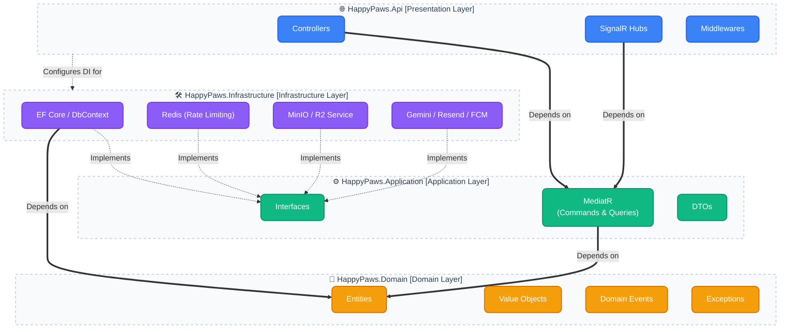
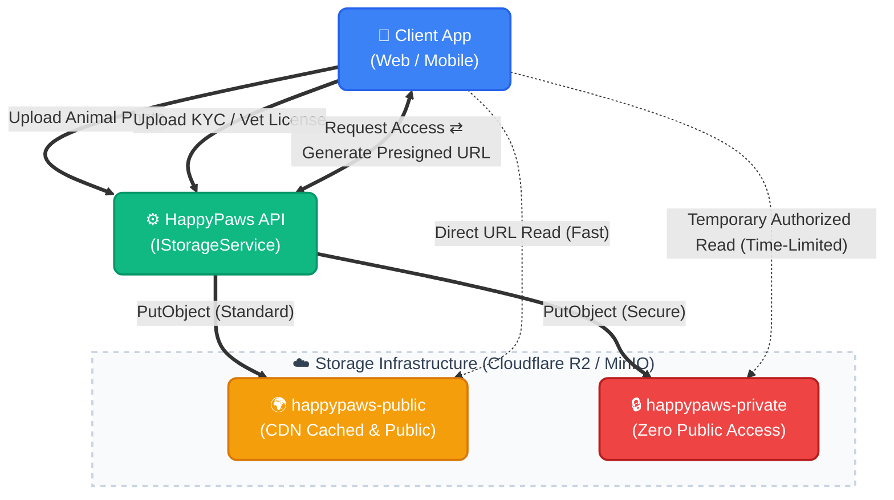
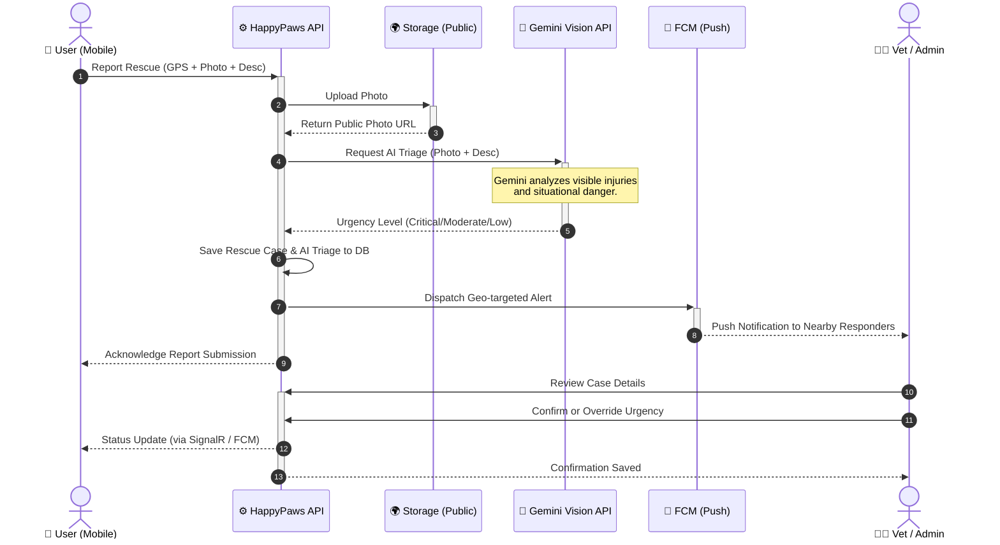

# Happy Paws Platform Architecture

This document provides a comprehensive overview of the architecture, design patterns, and infrastructure for the Happy Paws animal rescue and rehoming platform.

---

## 1. System Overview & High-Level Architecture

Happy Paws is built as a highly scalable, multi-client cloud-native application. The backend leverages ASP.NET Core (.NET 10) acting as a centralized REST API and Real-time server. Clients include a Flutter mobile app for field operations and a Next.js web application for administration and public listings.

### Layer Responsibilities
- **Domain**: Contains Enterprise Logic, Entities (e.g., `Animal`, `RescueCase`, `User`), Enums, and custom exceptions. Absolutely no NuGet packages related to databases or web frameworks.
- **Application**: Contains Business Logic, Use Cases orchestrated via CQRS (MediatR), and abstract interfaces (e.g., `IStorageService`, `IAiTriageService`, `IAppDbContext`).
- **Infrastructure**: Contains concrete implementations of interfaces. EF Core PostgreSQL mappings, S3 SDK logic, and external HTTP clients for Gemini and Resend.
- **Api**: The entry point. Registers Dependency Injection, configures JWT Authentication, maps endpoints via Controllers/Minimal APIs, and exposes Native OpenAPI (Scalar UI via `/scalar/v1`).

---

## 3. Storage Architecture (Public vs Private Buckets)

We utilize a dual-bucket object storage strategy abstracted behind an `IStorageService`. This allows local development using MinIO and production deployment using Cloudflare R2 without code changes.

- **happypaws-public**: Used for animal listings, public avatars, and general rescue photos. These are cached via CDN and served directly to clients.
- **happypaws-private**: Strict IAM policies block all public reads. Used for sensitive KYC identity documents and veterinary licenses. Access is granted exclusively through short-lived Presigned URLs generated by the API after authenticating and authorizing the requester.

---

## 4. AI Rescue Reporting & Triage Pipeline

When a user reports an emergency rescue, the system leverages Google AI Studio (Gemini Vision API) to analyze the provided image and text description to intelligently triage the severity, helping dispatch the right help faster.

The AI triage acts as a first-line assessment. Authorized Veterinarians and Administrators have the capability to manually override the severity classification.

---

## 5. Real-time Communication & Live Coordination

Happy Paws employs **SignalR** to facilitate real-time interactions critical for live rescue operations.
- **In-App Messaging**: Secure, peer-to-peer chat between Fosters, Adopters, and Vets tied to specific rescue cases.
- **Live Tracking**: Transporters can broadcast their location updates to a specific Hub Group, allowing coordinators to track ETA on a live map.
- **Status Updates**: Immediate UI refreshes across connected clients when a rescue case status changes (e.g., from `Reported` to `InTransit`).

---

## 6. Web & Admin Route-Gating Architecture (`apps/web`)

The Next.js application serves both public visitors and internal administrators, requiring strict boundary management.

- **Public Routes** (`/`, `/adopt`, `/about`): Utilize React Server Components (RSC) to fetch public listings directly from the API. SEO optimized and heavily cached.
- **Admin Dashboard** (`/admin/*`):
  - Protected via Next.js Middleware (`middleware.ts`).
  - The middleware intercepts requests to `/admin`, verifies the presence of a valid JWT HttpOnly cookie, and decodes the role.
  - If the role is not `Administrator`, the user is redirected to a 403 Forbidden or Login page before the route even renders.

---

## 7. Security, Auth & Compliance

### Role-Based Access Control (RBAC) Matrix
The system relies on JWT claims to enforce authorization across both the API and Web Admin.

| Role | Permissions |
| :--- | :--- |
| **Adopter** | Create adoption applications, message fosters. |
| **Foster** | Manage fostered animals, update statuses, message vets. |
| **Transporter**| Accept transport requests, broadcast live location. |
| **Sponsor** | View financial breakdowns of sponsored cases. |
| **Veterinarian**| Override AI triage, verify medical records, update health status. |
| **Administrator**| Full system access, approve KYC, manage users, dispute resolution. |

### Security Measures
- **Authentication**: Stateless JWT tokens signed with RS256/HS256. Access tokens are kept short-lived, supplemented by secure, HttpOnly refresh tokens.
- **Rate Limiting**: Redis is the primary mechanism to strictly limit OTP generation, login attempts, and password resets (lockout after 3-5 failed attempts) protecting authentication endpoints from brute-force attacks.
- **KYC & PII Protection**: Sensitive identity data (National ID cards, Passports) are stored exclusively in `happypaws-private`. Database records containing PII (Phone numbers, physical addresses) are encrypted at rest.
- **API Documentation**: The API exposes an OpenAPI specification rendered via Scalar (`/scalar/v1`). In production environments, this endpoint is either disabled or protected behind admin credentials. TypeScript and Dart DTOs are strictly generated from this spec to prevent contract drift.
